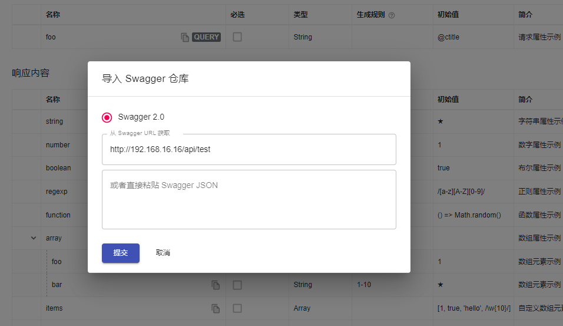
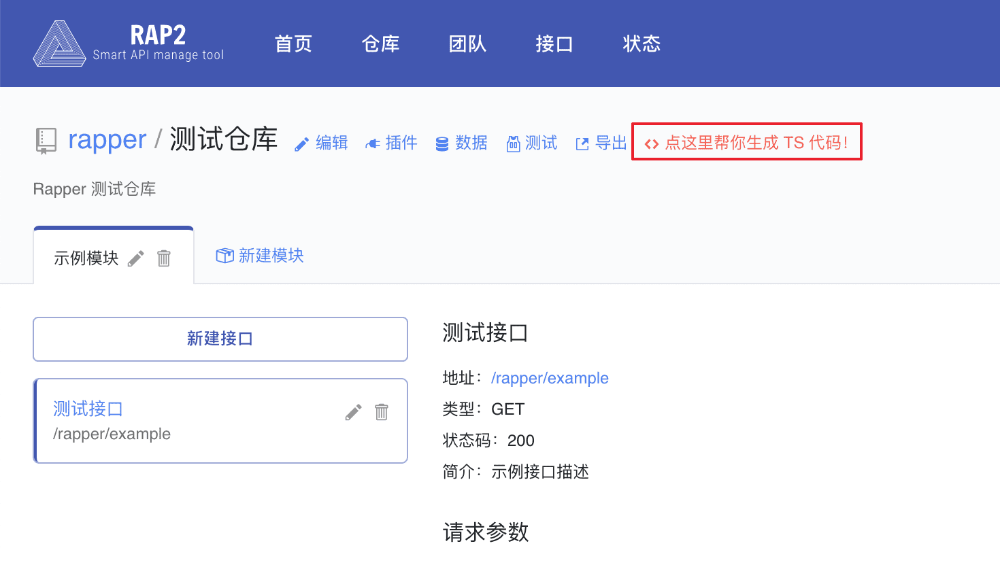
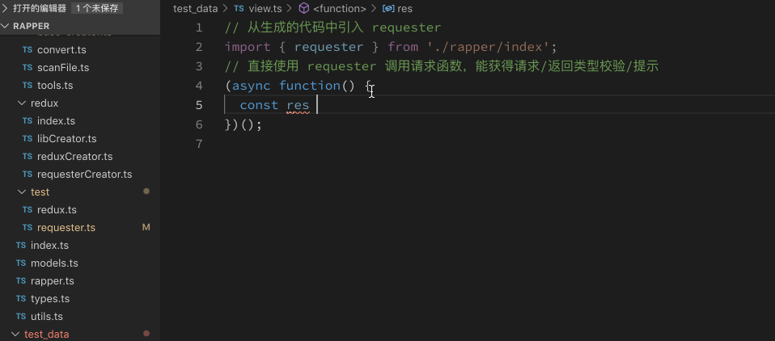
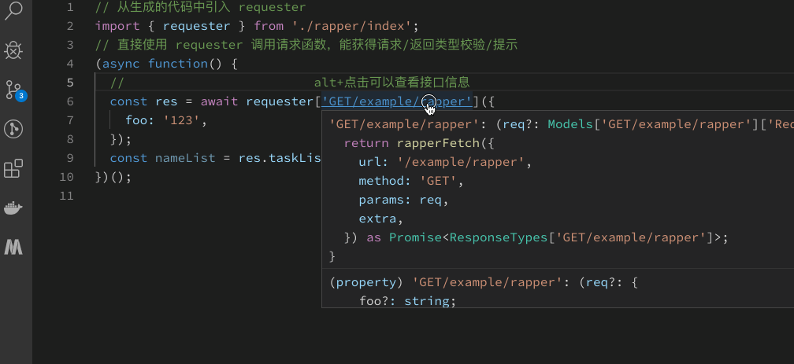

# 前后端分离的api维护起来很烦人，该如何处理

随着移动端的兴起，前端逐渐走上舞台，使用的语言变成了Javascript，项目开始实施前后端分离。前后端分离的项目里，后端负责开发接口，前端负责消费接口。维护api逐渐成一个困扰前后端的问题

- API字段更新了，前端突然莫名报错
- API路由更新了，404
- API字段对应的值类型改变了，未返回预期的值
- API被删除了

等等

**API 的维护是一件烦人的事，所以最好能一次设计好 API。**可是这是不可能的，API在其生命周期中，总是要不停变换，以适应变换的业务需求。

API维护成为了一个麻烦的事情，需求变了，需要修改API。API变了，需要通知前端做成对应的修改。

同时还存在另一种问题，后端在进行代码重构或优化的时，优化了API。但后端忘记通知前端API改变了，同事前端JavaScript没有强类型检查，导致前端项目运行时报错。

长期的这种重复性劳动，让前后端都很疲惫。

接下来我们讨论一下，前后端分离后的API是如何处理的


## 使用文档规范 API

不论是异地，还是坐一起协作开发，使用 API 文档来确保对接成功，是一个“低成本”、较为有效的方法。在这一点上，使用接口及函数调用，与使用 REST API 来进行通讯，并没有太大的区别。

先写一个 API 文档，双方一起来维护，文档放在一个公共的地方，方便修改，方便沟通。慢慢的再随着需求或实现方式发生变化，如无法提供事先定好的接口、再去修改接口及文档。

可这个时候因为没有一个可用的 API，因此前端开发人员便需要自己去 Mock 数据，或者搭建一个 Mock Server 来完成后续的工作。

这时就出现两个问题：

* 维护API文档很痛苦
* 需要一个同步的Mock Server

对于API文档来说，我们可以采用swagger，它是基于 YAML语法定义 RESTful API，如：

```YAML
swagger: "2.0"

info:
  version: 1.0.0
  title: Simple API
  description: A simple API to learn how to write OpenAPI Specification

schemes:
  - https
host: simple.api
basePath: /openapi101

paths: {}
```

它会自动生成一篇排版优美的API文档，与此同时还能生成一个供前端人员使用的 Mock Server。同时，它还能支持根据 Swagger API Spec 生成客户端和服务端的代码。

然而，它并不能解决没有人维护文档的问题，并且无法及时地通知另外一方。当后端开发人员修改API时，前端开发人员无法及时地知道，反之亦然。


## 基于rap2和swagger，自动生成接口列表和接口类型，同时同步mock server 

基于使用文档规范API的方式，前端人员需要自己去搭建 Mock Server 的。可是，这个 Mock API 的准确性则是由后台来保证的，因此它需要共同去维护。

有没有一种方式，在API发生变化的时候，能及时通知对方，但又不需要共同去维护。

如果能解决这个问题，那么前后端的开发效率肯定会有很大提升。

### RAP2

[RAP2](https://github.com/thx/rap2-delos)是阿里前端开源的接口管理工具，提供方便的接口文档管理、Mock、导出等功能。

rap2支持swagger导入，生成API，这样就解决了，mock server同步问题。




### Rapper

[Rapper](https://github.com/thx/rapper/) 是 TypeScript 的最佳拍档，它可以帮你生成具有类型定义的请求方案。

- 无需自行书写请求代码，把 HTTP 接口当做函数调用
- 请求参数/返回数据类型化，静态校验、自动补全快到飞起
- 对 React/Redux 特别优化，提供全局数据方案，hooks 轻松使用

1. 进入仓库，点击配置「生成 TS 代码」



2. 按照指引把 Rapper 安装到项目中
3. 执行 `npm run rapper` 生成代码
4. 引入生成的 fetch 函数，调用它就能发起请求并返回带有类型的相应数据

```
// 从生成的代码中引入 requester
import { fetch } from './rapper/index';
// 直接使用 requester 调用请求函数，能获得请求/返回类型校验/提示
(async function() {
  //                         alt+点击可以查看接口信息
  const res = await requester['GET/example/rapper']({
    foo: '123',
  });
  const nameList = res.taskList.map(e => e.name);
})();
```

##### 友好的类型约束和提示



##### 跳转到Rap查看接口文档




## 小结

使用Rap2，自动同步swagger文档，并生成接口。Rapper则为前端提供了接口定义。

如果API有变化，无论是前端还是后端修改了API，都会在Rap2中反映出来，同时前端有Typescript的类型检查，能第一时间发现API变化，并且能知道发生了什么变化。

前端和后端都可以更专注与自己的工作，提示开发效率。


## 参考链接

* [https://github.com/phodal/fe/blob/master/chapters/chapter-13.md](https://github.com/phodal/fe/blob/master/chapters/chapter-13.md) 如何处理好前后端分离的 API 问题
* [https://github.com/thx/rapper/](https://github.com/thx/rapper/) Rapper